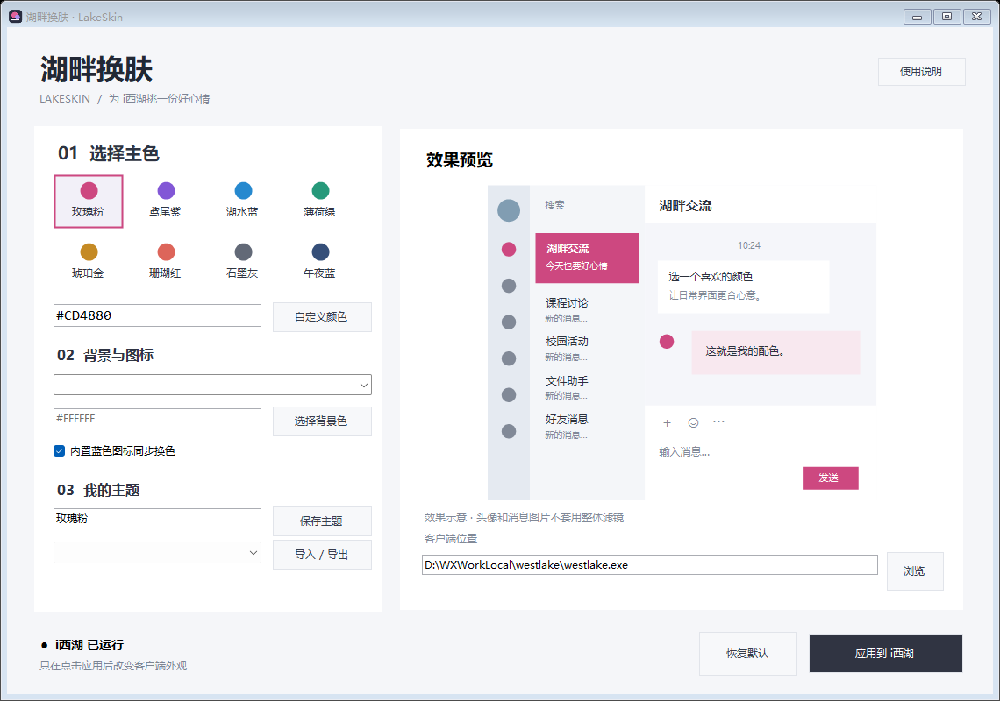

# 湖畔换肤 · LakeSkin

适配特定版本 i西湖 Windows 客户端的本地换肤工具。提供八套预设、自定义主色与纯色背景、内置图标换色、主题保存 / 导入 / 导出，以及恢复默认。



## 使用

下载仓库 ZIP 后完整解压，双击 `LakeSkin.exe`，选择客户端路径和颜色，再点击“应用到 i西湖”。必须保留 `engine` 文件夹，不能只复制 EXE。保持“跟随客户端默认背景”即可保留原有聊天背景。目前不支持图片背景。

运行环境：Windows x64、.NET Framework 4.8。适配目标：i西湖 3.5.0.4433 / Qt 5.15.18.0。不是通用 Qt 换肤器，不保证客户端升级后或其他电脑上兼容；程序会检查 Qt 版本。工具与客户端需要相同用户和相应进程访问权限。

用户已确认在开发使用的电脑上可运行。部分网页、自绘控件和第三方标志可能保留原色。详细步骤和限制见 [使用说明](使用说明.md)，测试范围见 [验证记录](验证记录.md)。

## 开发

- `source/Studio.cs`：C# WinForms 界面、主题管理和进程操作入口。
- `source/bridge.cpp`：Qt 样式应用与恢复。
- `source/accent.cpp`、`source/icons.cpp`：绘制时颜色映射与图标识别。
- `source/helper.cpp`：版本检查和运行时模块加载。
- `engine/`：已编译模块和资源指纹；不含客户端安装包或 Qt 库。
- `themes/`：八套基础主题。

使用 MinGW-w64 g++ 与 .NET Framework C# 编译器重建：

```powershell
.\source\build.ps1 -Gpp 'C:\mingw64\bin\g++.exe'
```

本地测试需要 Python + PyQt5；图标测试还需要对应版本的本地客户端资源，并按安装位置调整测试脚本中的资源路径。

```powershell
python source/tests/test_engine.py
python source/tests/test_icons.py
.\LakeSkin.exe --self-test
```

## 工作方式

通过运行时模块加载、Qt 样式表（QSS）及绘制函数导入表拦截映射蓝色元素。修改发生在客户端进程内存，不改写客户端安装文件。点击恢复默认可停用映射；完全退出客户端释放模块。软件自身不联网、不上传聊天内容。

这是独立适配项目，与 i西湖及其开发者没有官方关联。本仓库未指定开源许可证。
